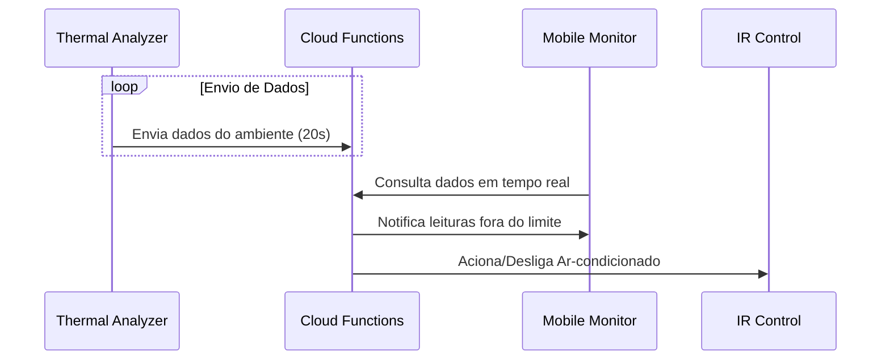

<h1 style="text-align:center">🛡️ Guardia Tech</h1>

<h2>🏗️ Sobre a Organização</h2>

    Essa organização agrega os repositórios da Solução Guardia, um <b>Sistema de Monitoramento e Automação Industrial</b> desenvolvido no curso Big Data para Negócios na Fatec Ipiranga.

<h2>💬 Sobre a Solução Guardia</h2>

    A solução Guardia surgiu com a implementação de uma solução de IoT para monitoramento térmico em tempo real na indústria alimentícia, focando na conformidade de temperatura e umidade oferecendo:
     
      
<ul>
    <li>
    <b>Arquitetura Serverless:</b> Firebase Cloud Functions para processamento de eventos e lógica de negócio na nuvem, automatizando o envio de alertas e o controle de dispositivos externos.
    </li>
    <li>
    <b>Monitoramento em Tempo Real:</b> Os sensores DHT22 e ESP32 permitem telemetria contínua enviando os dados para o Firebase Realtime Database para armazenamento e sincronização de dados.
    </li>
    <li>
    <b>Automação de Dispositivos (Edge Computing)</b> Sistema de controle de climatização automatizado via emissor IR, acionado via nuvem para manter a temperatura dentro dos limites operacionais.
    </li>
    <li>
    <b>Aplicativo Mobile:</b> Guardia conta também com um aplicativo mobile para visualização de métricas e recebimento de notificações push em caso de anomalias térmicas.
    </li>
</ul>
    

<h2>🔃 Fluxo da Solução</h2>

<h2>ℹ️ Descrição dos segmentos</h2>

    Nessa seção será descrito o funcionamento de cada segmento do projeto, explicando seus objetivos, tecnologias e funcionamento.

<h3>🌡️ Segmento 1: Guardia Thermal Analyzer </h3>

    Esse foi o primeiro segmento desenvolvido e que deu origem a todos os demais, seu objetivo é <b>coletar dados de temperatura e umidade</b> do ambiente. Para isso foi elaborado um sistema com <b>ESP-32</b> e sensores <b>DHT-22</b> que coletam esses dados em um intervalo de tempo determinado, por padrão é de 20 segundos. O ESP-32 tem a capacidade de se conectar a internet via Wi-Fi, com isso ele envia esses dados para serem processados, no caso ele envia para o <b>Firebase</b>, que é onde temos o segundo segmento do projeto.
     
    A linguagem de programação utilizada foi micropython, devido a sua facilidade de uso e aprendizagem.

<h3>☁️ Segmento 2: Guardia Cloud Functions</h3>

    Esse segmento é o que contempla as configurações utilizadas no Firebase e no Firebase Cloud Functions. Este é um projeto serverless que utiliza o Cloud Functions para executar a lógica de backend e o Firebase Realtime Database para armazenar os dados. 
    No Cloud Functions foi criada uma função em Typescript que executa sempre que um novo registro, referente a uma leitura dos sensores, é realizado com isso é validado se os valores estão dentro do limite de segurança definido pelo usuário, caso não esteja ele envia uma notificação para o aplicativo móvel (Segemento 3) avisando da anomalia e pode acionar automaticamente o sistema de controle do ar-condicionado (Segmento 4). 

<h3>📊 Segmento 3: Guardia Mobile Monitor</h3>

    O Mobile Monitor é a forma prática do usuário poder conferir as medições em tempo real e ser notificado quando a temperatura ou umidade saem do limite estipulado. 
    Ele foi desenvolvido em Flutter com linguagem Dart, e utiliza a biblioteca flutter fire para se comunicar o Firebase.

<h3>🤖 Segmento 4: Guardia IR Control</h3>

    Guardia IR Control é o sistema de automação baseado em sinal infravermelho, com ele é possível decodificar o sinal de um controle, por exemplo de um ar-condicionado, e replicá-lo com um emissor IR, dessa forma permitindo automatizar o controle desses sistemas. 
    O projeto foi escrito em Linguagem C do Arduino devido ao melhor suporte de bibliotecas. 

