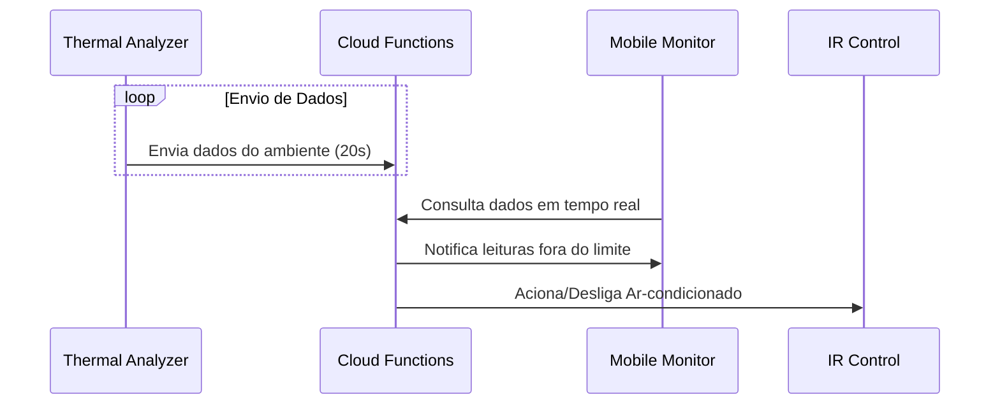

# 🛡️ Guardia Tech

## 🏗️ Sobre a Organização

Essa organização agrega os repositórios da **Solução Guardia**, um **Sistema de Monitoramento e Automação Industrial** desenvolvido no curso Big Data para Negócios na Fatec Ipiranga.

---

## 💬 Sobre a Solução Guardia

A solução Guardia surgiu com a implementação de uma solução de IoT para monitoramento térmico em tempo real na indústria alimentícia, focando na conformidade de temperatura e umidade oferecendo:

- **Arquitetura Serverless:** Redução de custos operacionais e escalabilidade automática com Firebase.
- **Monitoramento em Tempo Real:** Telemetria precisa com sensores DHT22 e baixa latência via Realtime Database.
- **Automação de Dispositivos (Edge Computing):** Resposta imediata a anomalias térmicas via controle IR.

---

## 🛠️ Resumo Técnico dos Segmentos

| Segmento | Tecnologia Principal | Papel no Sistema |
| :--- | :--- | :--- |
| [**🌡️ Thermal Analyzer**](https://github.com/guardia-technology/guardia-thermal-analyzer) | MicroPython / ESP32 | Coleta e telemetria de dados ambientais |
| [**☁️ Cloud Functions**](https://github.com/guardia-technology/guardia-cloud-functions) | TypeScript / Firebase | Cérebro do sistema e lógica de automação |
| [**📊 Mobile Monitor**](https://github.com/guardia-technology/guardia-mobile-monitor) | Flutter / Dart | Interface mobile e alertas em tempo real |
| [**🤖 IR Control**](https://github.com/guardia-technology/guardia-ir-control) | C++ (Arduino) / ESP32 | Execução física da automação via infravermelho |
---

## 🔃 Fluxo da Solução

## 🚀 Acesso Rápido aos Repositórios

- 🌡️ [Guardia Thermal Analyzer](https://github.com/guardia-technology/guardia-thermal-analyzer) - Firmware de coleta (MicroPython).
- ☁️ [Guardia Cloud Functions](https://github.com/guardia-technology/guardia-cloud-functions) - Backend e lógica Serverless (TypeScript).
- 📊 [Guardia Mobile Monitor](https://github.com/guardia-technology/guardia-mobile-monitor) - Aplicativo de monitoramento (Flutter).
- 🤖 [Guardia IR Control](https://github.com/guardia-technology/guardia-ir-control) - Automação de hardware (C++/Arduino).

---

## ℹ️ Descrição dos segmentos

Nesta seção será descrito o funcionamento de cada segmento do projeto, explicando seus objetivos, tecnologias e funcionamento.

### 🌡️ Segmento 1: Guardia Thermal Analyzer 

Esse foi o primeiro segmento desenvolvido e que deu origem a todos os demais. Seu objetivo é **coletar dados de temperatura e umidade** do ambiente. Para isso, foi elaborado um sistema com **ESP-32** e sensores **DHT-22** que coletam esses dados em um intervalo de tempo determinado (por padrão, 20 segundos). O ESP-32 tem a capacidade de se conectar à internet via Wi-Fi para enviar esses dados ao **Firebase**, onde o processamento é realizado.

### ☁️ Segmento 2: Guardia Cloud Functions

Esse segmento contempla as configurações utilizadas no Firebase e no Firebase Cloud Functions. Este é um projeto serverless que utiliza o Cloud Functions para executar a lógica de backend e o Firebase Realtime Database para armazenar os dados.

No Cloud Functions, foi criada uma função em **TypeScript** que executa sempre que um novo registro de leitura dos sensores é realizado. O sistema valida se os valores estão dentro do limite de segurança definido pelo usuário; caso não estejam, envia uma notificação para o aplicativo móvel (**Segmento 3**) e aciona automaticamente o sistema de controle do ar-condicionado (**Segmento 4**).

### 📊 Segmento 3: Guardia Mobile Monitor

O Mobile Monitor é a forma prática de o usuário conferir as medições em tempo real e ser notificado quando a temperatura ou umidade saem do limite estipulado. Foi desenvolvido em **Flutter** para garantir uma interface fluida e multiplataforma.

### 🤖 Segmento 4: Guardia IR Control

O Guardia IR Control é o sistema de automação baseado em sinal infravermelho. Com ele, é possível decodificar o sinal de um controle remoto (como o de um ar-condicionado) e replicá-lo com um emissor IR, permitindo automatizar o controle desses sistemas de climatização de forma remota e inteligente.
